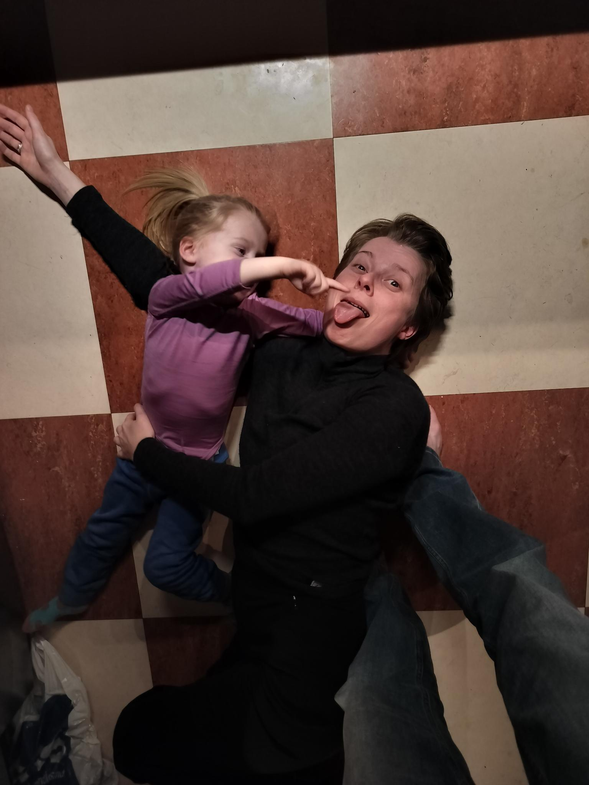
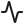

<!-- Background collage: gaari.no event-cards screenshot, dimmed -->

<!-- Plaster overlay for Funkis-feel + readable text -->

<!-- Top accent + bottom red strip on top of overlay -->

Faglig samling · 27. mai 2026

<h1 style="margin: 0 !important; font-size: 3.2rem !important; line-height: 1.1; color: var(--gaari-iron) !important; text-shadow: 0 1px 2px rgba(245, 243, 238, 0.8);">AI som byggeklosser</h1>

<h2 style="margin-top: 1rem; line-height: 1.35; font-size: 1.55rem; font-weight: 500; max-width: 44rem; text-align: center; color: var(--gaari-iron) !important; text-shadow: 0 1px 2px rgba(245, 243, 238, 0.8);">Slik bruker jeg AI til å bygge og drifte Gåri — en reell nettside i daglig produksjon</h2>

Kjersti V. Therkildsen · <a href="https://gaari.no" style="color: var(--gaari-red) !important;">gaari.no</a>

<!--
Speaker notes:
- Velkommen. 15-20 minutter pluss spørsmål.
- Tittelen er bevisst: "byggeklosser" — AI er et verktøy jeg bygger MED, ikke noe jeg har slått på.
- Hovedfokus i dag: HVORDAN jeg jobber. Gåri er bare eksempelet.
- Jeg viser konkrete eksempler fra produksjon — ingen demoer på lab-nivå.
-->

---

<h1 style="margin: 0 0 0.5rem 0; flex-shrink: 0; align-self: flex-start;">Hei, jeg er Kjersti</h1>

Tre ting om meg.

  
  

    
Kjersti V. Therkildsen

    
Master-student · Keio Media Design

  

Som designer har jeg brukt 1,5 år på å utforske hvordan KI kan forme en ny hverdag.

Event-sidene i Bergen er dårlig designet — jeg tror jeg kan gjøre bedre.

Jeg er ingen utvikler eller ekspert — men jeg er ikke redd for å lære mens jeg gjør.

<!--
Speaker notes:
- Bombastisk åpning, men ærlig: jeg bruker KI i alt, og det er verktøyet som lar meg bygge.
- "Min måte å jobbe": masteren handler om KI, Claude Code er hovedverktøyet.
- "Hvorfor Gåri": vær direkte — sidene som finnes er dårlige. Feil designprinsipper, ikke menneske-i-sentrum. Jeg mener jeg kan bedre, så jeg prøver.
- "Hva driver meg": utålmodig, ikke utvikler, men god på ideer og logikk. Vil ikke bli stoppet av "vi har ikke tid/penger".
- Hvis spørsmål om provokativ tone: ja, det å bygge noe selv tråkker på faglig arbeid andre har gjort. Men det er sånn ny teknologi alltid har gjort — de som begynte å trykke bøker tråkket på kalligrafien. Nye verktøy gjør at nye stemmer får bygge.
- Det er en historisk mønster, ikke en personlig diss av designere/utviklere.
-->

---

<h1 style="margin: 0 0 1.2rem 0; flex-shrink: 0; align-self: flex-start;">Hva er Gåri?</h1>

<strong>Ett sted hvor du finner alt som skjer i Bergen.</strong>

Arrangementer ligger spredt over mange plattformer. Det gir lite oversikt. Gåri samler dem på <a href="https://gaari.no" style="color: var(--rose-red-deep);">gaari.no</a>.

Jeg hadde en idé. Med <strong>Claude Code som verktøy</strong> klarte jeg å bygge det ved siden av studiet — og lære mens jeg laget.

  <video autoplay muted loop playsinline style="width: 100%; max-height: 100%; aspect-ratio: 16/9; object-fit: contain; box-shadow: 0 6px 20px rgba(28,28,30,0.2); border: 1px solid var(--gaari-shadow-light);">
    <source src="./assets/gaari-forside.mp4" type="video/mp4">
  </video>

<!--
Speaker notes:
- Ikke gå dypt inn i Gåri her — én setning, så videre.
- Hvis noen spør "hvorfor" — fortell at jeg savnet det selv etter flytting tilbake til Bergen.
- "AI er den eneste grunnen til at dette finnes" — sett opp resten av foredraget.
- Sjekk at gaari.no er oppe før presentasjonen. Vis evt. nettsiden live hvis prosjektor tillater.
-->

---

<h1 style="margin: 0 0 0.5rem 0; flex-shrink: 0; align-self: flex-start;">Én rolle, hele stacken</h1>

<strong>8 fagområder</strong> — tradisjonelt 5–8 personer. Her: én student + AI, ved siden av studiet.

Utvikling

SvelteKit 2 + Svelte 5 · Supabase · Vercel ISR · GitHub Actions · TypeScript

Design

Tailwind CSS 4 · Funkis-designsystem · Inter + Barlow Condensed · WCAG-kontrast

Innhold

57 Cheerio-scrapere · Gemini 2.5 Flash · NO + EN · 50+ kuraterte tema-sider

SEO &amp; data

Search Console · Bing Webmaster · Umami · søkeordsanalyse · backlink-strategi

Kommunikasjon

Protonmail · MailerLite · ukentlig nyhetsbrev · outreach · HTML-signatur

Sosiale medier

Graph API · Business Suite · carousel · captions · plakatdesign (SVG)

Drift

UptimeRobot · health-endpoints · scraper-anomalier · daglig digest-mail

B2B &amp; jus

Stripe · promo placements · prospect-rapporter · GDPR + åndsverkslov

<!--
Speaker notes:
- Hele poenget med denne sliden: BREDDEN. Ikke dybden av kompetanse, men antallet roller én person nå kan dekke.
- 8 kort dekker alt fra typisk fullstack-utvikling til SoMe og juridisk arbeid.
- Pek på et par konkrete eksempler du brenner for — f.eks. at Funkis-designsystemet er bygget med AI som "designer-sparringpartner", eller at Stripe-flyten kom på plass på en kveld.
- Ikke les opp alle 32 verktøyene. Pek på blokkene; folk leser raskere enn du snakker.
- Bunntekst: tradisjonelt ville dette krevd: utvikler + designer + content/copywriter + SEO + outreach + SoMe-ansvarlig + drift + B2B-selger = 5-8 personer.
- Hvis spørsmål om læringskurve: jeg er ikke ekspert i alle 8 områdene. AI lar meg være "god nok" i hvert område til at sluttproduktet fungerer.
-->

---

<h1 style="margin: 0 0 0.5rem 0; flex-shrink: 0; align-self: flex-start;">Alt håndteres herfra</h1>

Motherboardet — <strong>én terminal, åtte porter</strong> inn til hele Gåri.

<!-- SVG: PCB-style traces. Layout:
     Modules:  top row 0→20%, bottom row 80→100% — height 20% each
     Terminal: 30→70% vertical, 20→80% horizontal — height 40%, width 60%
     Trace gap zones: 20→30% (top), 70→80% (bottom)
     Module x-centers: 12.5%, 37.5%, 62.5%, 87.5%
     Terminal connection pads at top/bottom edges: 4 evenly-spaced pins -->
<svg viewBox="0 0 900 420" preserveAspectRatio="none" style="position: absolute; inset: 0; width: 100%; height: 100%; z-index: 0; pointer-events: none;">

  <!-- Top traces: module bottom (y=84) → midpoint (y=105) → terminal top (y=126) -->
  <path d="M 112.5 84 L 112.5 105 L 274 105 L 274 126" stroke="#C82D2D" stroke-width="1.5" fill="none" />
  <path d="M 337.5 84 L 337.5 105 L 390 105 L 390 126" stroke="#C82D2D" stroke-width="1.5" fill="none" />
  <path d="M 562.5 84 L 562.5 105 L 510 105 L 510 126" stroke="#C82D2D" stroke-width="1.5" fill="none" />
  <path d="M 787.5 84 L 787.5 105 L 626 105 L 626 126" stroke="#C82D2D" stroke-width="1.5" fill="none" />

  <!-- Bottom traces: module top (y=336) → midpoint (y=315) → terminal bottom (y=294) -->
  <path d="M 112.5 336 L 112.5 315 L 274 315 L 274 294" stroke="#C82D2D" stroke-width="1.5" fill="none" />
  <path d="M 337.5 336 L 337.5 315 L 390 315 L 390 294" stroke="#C82D2D" stroke-width="1.5" fill="none" />
  <path d="M 562.5 336 L 562.5 315 L 510 315 L 510 294" stroke="#C82D2D" stroke-width="1.5" fill="none" />
  <path d="M 787.5 336 L 787.5 315 L 626 315 L 626 294" stroke="#C82D2D" stroke-width="1.5" fill="none" />

  <!-- Connection pads on motherboard edge -->
  <circle cx="274" cy="126" r="3.5" fill="#C82D2D" />
  <circle cx="390" cy="126" r="3.5" fill="#C82D2D" />
  <circle cx="510" cy="126" r="3.5" fill="#C82D2D" />
  <circle cx="626" cy="126" r="3.5" fill="#C82D2D" />
  <circle cx="274" cy="294" r="3.5" fill="#C82D2D" />
  <circle cx="390" cy="294" r="3.5" fill="#C82D2D" />
  <circle cx="510" cy="294" r="3.5" fill="#C82D2D" />
  <circle cx="626" cy="294" r="3.5" fill="#C82D2D" />
</svg>

<!-- Top row: 4 modules -->

  

    
    
Utvikling

  

  

    
    
Design

  

  

    
    
Innhold

  

  

    
    
SEO

  

<!-- Center: motherboard / terminal -->

claude · ~/Gaari

$ claude

&gt; sett opp ny scraper, send eposten, lag ukentlig FB-post

⏺ kobler til 8 systemer …

✓ ferdig på 4 min

<!-- Bottom row: 4 modules -->

  

    
    
Kommunikasjon

  

  

    
    
Sosiale medier

  

  

    
    
Drift

  

  

    
    
B2B &amp; jus

  

<!--
Speaker notes:
- Motherboard-metaforen: claude-terminalen er CPU-en, de 8 fagområdene er "portene" som plugger inn.
- Pek på de røde kretsbanene: alt går INN i én sentral hub. Det er hele poenget.
- Forklar at samme verktøy (Claude Code i terminalen) kan håndtere kode, e-poster, SEO-rapporter, social posts — det er ikke 8 separate verktøy, det er ett.
- Hvis spørsmål om kostnad: ca 200 USD/mnd til Claude Max. Betaler seg inn raskt.
- Hvis spørsmål om hva som faktisk skjer på "kobler til 8 systemer ...": Claude Code har MCP (Model Context Protocol) tilkoblinger til e-post, Facebook, etc. Reell teknologi, ikke marketing.
-->

<!--
Speaker notes:
- Pek på skjermbildet: dette er hvor jeg sitter hver dag.
- Forklar de tre panelene: filer til venstre, redigering i midten, Claude-terminalen til høyre (eller nede).
- Claude Code er en CLI-agent (Anthropic). Den leser hele kodebasen, kjører kommandoer, skriver filer direkte.
- "Det jeg gjør her" — fire kategorier dekker ~90% av arbeidet mitt. Ikke bare koding.
- Folk forventer at AI = chatbot. Dette er en helt annen kategori: agent med tilgang til reelle verktøy.
- Hvis spørsmål om kostnad: ca 200 USD/mnd til Claude Max. Betaler seg inn raskt.
-->

---

<h1 style="margin: 0 0 0.3rem 0; flex-shrink: 0; align-self: flex-start;">Systemarkitektur</h1>

Tjenestene er plattformen — koden, scriptene og dataen har jeg bygget. <strong>Rødt</strong> = kjernestacken · Mørkt = AI i kjøretiden.

<!-- SVG: 2 main flow arrows + observability "watches"-line -->
<svg viewBox="0 0 900 460" preserveAspectRatio="none" style="position: absolute; inset: 0; width: 100%; height: 100%; z-index: 0; pointer-events: none;">

  <!-- INGEST → CORE (thick red) -->
  <line x1="245" y1="170" x2="298" y2="170" stroke="#C82D2D" stroke-width="3" marker-end="url(#flowArrow)" />
  <!-- CORE → DISTRIBUTION (thick red) -->
  <line x1="602" y1="170" x2="655" y2="170" stroke="#C82D2D" stroke-width="3" marker-end="url(#flowArrow)" />

  <!-- Drift bus pattern: rail in the gap above Drift-band (no overlap with title text) -->
  <line x1="165" y1="358" x2="165" y2="350" stroke="#1C1C1E" stroke-width="1.2" stroke-dasharray="4,3" />
  <line x1="450" y1="358" x2="450" y2="350" stroke="#1C1C1E" stroke-width="1.2" stroke-dasharray="4,3" />
  <line x1="745" y1="358" x2="745" y2="350" stroke="#1C1C1E" stroke-width="1.2" stroke-dasharray="4,3" />
  <line x1="160" y1="350" x2="780" y2="350" stroke="#1C1C1E" stroke-width="1.2" stroke-dasharray="4,3" />
  <line x1="780" y1="350" x2="780" y2="336" stroke="#1C1C1E" stroke-width="1.5" stroke-dasharray="4,3" marker-end="url(#watchArrow)" />

  <defs>
    <marker id="flowArrow" viewBox="0 0 10 10" refX="9" refY="5" markerWidth="8" markerHeight="8" orient="auto-start-reverse">
      <path d="M 0 0 L 10 5 L 0 10 z" fill="#C82D2D" />
    </marker>
    <marker id="watchArrow" viewBox="0 0 10 10" refX="9" refY="5" markerWidth="6" markerHeight="6" orient="auto-start-reverse">
      <path d="M 0 0 L 10 5 L 0 10 z" fill="#1C1C1E" />
    </marker>
  </defs>
</svg>

<!-- ========== INGEST ZONE (left) — GREY tint ========== -->

Inntak

<strong>57 venue-nettsider</strong>

Cheerio HTML-scrape

<strong>/submit-skjema</strong>

Brukerinnsendelser

<strong>Stripe webhook</strong>
B2B-kjøp

<strong>Protonmail Bridge</strong>
innkommende e-post

<!-- ========== CORE ZONE (middle) — RED tint, trust boundary ========== -->

Kjernestack

<strong>GitHub Actions</strong>
13 cron-workflows

<strong style="color: var(--gaari-red);">Gemini</strong>
tekst NO+EN

<strong style="color: var(--gaari-red);">Claude</strong>
utvikling

<strong>Supabase</strong>
Postgres · Storage · 9 tabeller

<strong>Vercel</strong>
SvelteKit · ISR-cache

<!-- ========== DISTRIBUTION ZONE (right) — GREY tint ========== -->

Distribusjon

<strong>gaari.no</strong>

SvelteKit · NO + EN

<strong>E-post</strong>
Resend + MailerLite

<strong>Meta Graph API</strong>
FB + Instagram

<!-- ========== OBSERVABILITY BAND (bottom) ========== -->

Drift

— overvåker gaari.no fra ulike vinkler (liveness, trafikk, SEO)

<strong>UptimeRobot</strong>
/api/health hver 5 min

<strong>Umami</strong>
trafikk · klikk · events

<strong>Google Search Console</strong>
SEO + Bing API

<!--
Speaker notes:
- Helhetlig systemarkitektur — fra venstre til høyre: kilder, pipeline+AI, kjerne, mottakere.
- Pek på rødt: pipeline-stegene som AI driver (Gemini for tekst, Claude for utvikling).
- Kjerne: Supabase er "hjertet" — alt går igjennom databasen. Vercel er hosting + ISR-cache.
- Mottakere: gaari.no, e-post (Resend transaksjonell, MailerLite nyhetsbrev), Meta (FB/IG), Stripe (B2B).
- Drift-stripen: alle 4 observerer kontinuerlig — UptimeRobot pinger hvert 5. min, Umami måler trafikk, Search Console/Bing for SEO, daglig digest summerer alt.
- Hvis spørsmål om kostnad: Vercel + Supabase free tier + Claude Max ~200 USD/mnd + Gemini ~5 USD/mnd + MailerLite gratis tier.
- Hvis spørsmål om mer detalj: 9 Supabase-tabeller (events, scraper_runs, social_posts, social_insights, promoted_placements, placement_log, edit_suggestions, opt_out_requests, organizer_inquiries).
-->

---

<h1 style="margin: 0 0 0.6rem 0; flex-shrink: 0; align-self: flex-start;">En typisk økt</h1>

Menneske og AI bytter på. <strong>Tre menneskeoverganger per økt</strong> — beskrive, godkjenne, verifisere. Der lever dømmekraften. <strong>Minutter, ikke dager.</strong>

<!-- DU lane: label column + bg -->

  

    DU
  

  

<!-- AI lane: label column + bg -->

  

    AI
  

  

<!-- SVG: only connecting arrows -->
<svg viewBox="0 0 900 420" preserveAspectRatio="none" style="position: absolute; inset: 0; width: 100%; height: 100%; z-index: 1; pointer-events: none;">

  <!-- All paths: L-shaped PCB-style steps with sharp corners -->
  <!-- 1→2 (DU bottom → AI top) -->
  <path d="M 157 147 L 157 195 L 288 195 L 288 244" stroke="#6B6862" stroke-width="1.5" fill="none" marker-end="url(#arr)" />
  <!-- 2→3 (AI top → DU bottom) -->
  <path d="M 288 244 L 288 195 L 418 195 L 418 147" stroke="#6B6862" stroke-width="1.5" fill="none" marker-end="url(#arr)" />
  <!-- 3→4 (DU bottom → AI top) -->
  <path d="M 418 147 L 418 195 L 549 195 L 549 244" stroke="#6B6862" stroke-width="1.5" fill="none" marker-end="url(#arr)" />
  <!-- 4→5 (AI top → DU bottom) -->
  <path d="M 549 244 L 549 195 L 679 195 L 679 147" stroke="#6B6862" stroke-width="1.5" fill="none" marker-end="url(#arr)" />
  <!-- 5→6 (DU bottom → AI top, red — final deploy) -->
  <path d="M 679 147 L 679 195 L 810 195 L 810 244" stroke="#C82D2D" stroke-width="2" fill="none" marker-end="url(#arrRed)" />

  <defs>
    <marker id="arr" viewBox="0 0 10 10" refX="8" refY="5" markerWidth="6" markerHeight="6" orient="auto-start-reverse">
      <path d="M 0 0 L 10 5 L 0 10 z" fill="#6B6862" />
    </marker>
    <marker id="arrRed" viewBox="0 0 10 10" refX="8" refY="5" markerWidth="7" markerHeight="7" orient="auto-start-reverse">
      <path d="M 0 0 L 10 5 L 0 10 z" fill="#C82D2D" />
    </marker>
  </defs>
</svg>

<!-- Step boxes -->

<!-- Step 1: DU -->

1 · Beskrive

Problem på norsk, med kontekst.

<!-- Step 2: AI -->

2 · Plan

Leser filer, foreslår tilnærming.

<!-- Step 3: DU -->

3 · Godkjenne

Veto, scope-kutt, korreksjon.

<!-- Step 4: AI -->

4 · Kode

Skriver, tester, retter feil selv.

<!-- Step 5: DU -->

5 · Verifisere

I nettleseren — føles det riktig?

<!-- Step 6: AI (auto-deploy) — AI-lane style, red title as the "exit" marker -->

6 · Live

Vercel bygger og publiserer. ~90 sek.

<!--
Speaker notes:
- Den viktigste sliden. Hvis publikum bare husker én ting, så er det denne flyten.
- Pek på de to lanes: "Du" oppe i rødt, "AI" nede i mørkt. Stegene veksler.
- Steg 1 og 3 (mine) — der jeg styrer scope og retning. Naturlig språk, ikke kode.
- Steg 5 — verifisering — det jeg MÅ gjøre selv. AI ser ikke om noe "føles" feil.
- Steg 6 er svart med rød kant fordi det er "exit"-steget. Commit + push.
- Bunntekst: tre menneskeoverganger. Det er der dømmekraften, smaken og ansvaret lever.
- Tidsbruk per feature: minutter til timer, sjelden dager.
-->

---

Utvikling

<h1 style="margin: 0 0 0.5rem 0; flex-shrink: 0; align-self: flex-start;">Ny scraper på 20 min</h1>

Det jeg ber om i terminalen — og resultatet på siden. <strong>Hver av de 57 kildene ble bygget slik.</strong>

1

Terminal — prompt til Claude

<video autoplay muted loop playsinline style="width: 100%; max-height: 100%; aspect-ratio: 16/9; object-fit: contain; box-shadow: 0 4px 14px rgba(28,28,30,0.18);">
<source src="./assets/claude-terminal.mp4" type="video/mp4">
</video>

→

2

Litteraturhuset live på gaari.no

<video autoplay muted loop playsinline style="width: 100%; max-height: 100%; aspect-ratio: 16/9; object-fit: contain; box-shadow: 0 4px 14px rgba(28,28,30,0.18); border: 1px solid var(--gaari-shadow-light);">
<source src="./assets/litthus-events.mp4" type="video/mp4">
</video>

<!--
Speaker notes:
- Pek på videoen: dette er HVA Claude Code faktisk gjør. Ikke en chatbot — en agent som leser, skriver, kjører kode.
- Web scraping er kjent som repetitivt utviklingsarbeid — perfekt eksempel for å vise effekten.
- 4-8 timer tradisjonelt er konservativt — kan være verre med kompleks DOM.
- Det endrer hva som er MULIG, ikke bare hvor raskt det går.
- Hvis spørsmål om kvalitet: jeg leser alltid gjennom koden før commit. Mer kommer på slide 9 (prinsipper).
-->

---

SEO &amp; data

<h1 style="margin: 0 0 0.5rem 0; flex-shrink: 0; align-self: flex-start;">Fra rapport til morgenrutine</h1>

Hver morgen <strong>kl 07:00</strong> ligger en datadrevet rapport i innboksen. <strong>Claude leser den</strong> og foreslår dagens prioriteringer.

1

Daglig digest på epost

<video autoplay muted loop playsinline style="max-width: 100%; max-height: 100%; aspect-ratio: 1/1; object-fit: contain; box-shadow: 0 4px 14px rgba(28,28,30,0.18); border: 1px solid var(--gaari-shadow-light);">
<source src="./assets/seo-digest.mp4" type="video/mp4">
</video>

→

2

Claude leser, prioriterer

<video autoplay muted loop playsinline style="width: 100%; max-height: 100%; aspect-ratio: 16/9; object-fit: contain; box-shadow: 0 4px 14px rgba(28,28,30,0.18);">
<source src="./assets/morning-terminal.mp4" type="video/mp4">
</video>

<!--
Speaker notes:
- Pek på videoen — det er en EKTE rapport jeg får hver morgen. Ikke en mockup.
- Hele scriptet (seo-weekly-report.ts + send-daily-digest.ts) ble bygget av Claude Code på én ettermiddag. Jeg beskrev hva jeg ville se, AI hentet integrasjonene, sendte e-post.
- Verdien: jeg er ikke en heltidsanalytiker. Men jeg har et heltids-analyseverktøy i innboksen.
- Hvis spørsmål om data: kommer fra reelle integrasjoner — Search Console-API, Umami-API, direkte SQL mot Supabase. Ingen mock.
- Dette er rollen jeg vanligvis ville hyret en analytiker for. AI gjør det for 0 kr/mnd.
-->

---

Sosiale medier

<h1 style="margin: 0 0 0.5rem 0; flex-shrink: 0; align-self: flex-start;">Fra terminal til admin</h1>

AI velger events, lager bilder, skriver caption. <strong>Hovedside: auto via Graph API. Resten manuelt i Business Suite.</strong> <strong>~30% av trafikken kommer herfra.</strong>

<!-- Two videos side-by-side with red arrow between -->

1

Terminal

<video autoplay muted loop playsinline style="width: 100%; max-height: 100%; aspect-ratio: 16/9; object-fit: contain; box-shadow: 0 4px 14px rgba(28,28,30,0.18);">
<source src="./assets/meta-cli.mp4" type="video/mp4">
</video>

→

2

Admin-siden — last ned

<video autoplay muted loop playsinline style="width: 100%; max-height: 100%; aspect-ratio: 16/9; object-fit: contain; box-shadow: 0 4px 14px rgba(28,28,30,0.18); border: 1px solid var(--gaari-shadow-light);">
<source src="./assets/admin-social.mp4" type="video/mp4">
</video>

<!--
Speaker notes:
- Det eksempelet som overrasker folk mest. "Du har en social media manager?" Nei, jeg har en pipeline.
- Pek på videoen: én kommando velger, lager bilde, skriver caption, publiserer.
- Hele løpet tar 5-10 min per uke. Vs. minst 5 timer hvis jeg gjorde alt manuelt.
- Stilguiden ligger som memory-fil i prosjektet. AI henter den, følger den.
- Autenticitet: jeg leser hver post før publisering. AI er forfatter-assistent, ikke ghost-writer.
- 30%-tallet er reelt — fra Umami-analytics, ikke estimat.
-->

---

Kommunikasjon

<h1 style="margin: 0 0 0.5rem 0; flex-shrink: 0; align-self: flex-start;">Ukentlig nyhetsbrev — på autopilot</h1>

Satt opp én gang. <strong>Sender seg selv hver mandag</strong> — AI velger events, skriver intro på norsk og engelsk, bygger HTML per abonnent og sender via MailerLite. Jeg trenger ikke å være der.

1

Scheduled — kjøres automatisk

<video autoplay muted loop playsinline style="width: 100%; max-height: 100%; aspect-ratio: 16/9; object-fit: contain; box-shadow: 0 4px 14px rgba(28,28,30,0.18);">
<source src="./assets/newsletter-cli.mp4" type="video/mp4">
</video>

→

2

Ferdig nyhetsbrev i innboksen

<video autoplay muted loop playsinline style="width: 100%; max-height: 100%; aspect-ratio: 16/9; object-fit: contain; box-shadow: 0 4px 14px rgba(28,28,30,0.18); border: 1px solid var(--gaari-shadow-light);">
<source src="./assets/newsletter-preview.mp4" type="video/mp4">
</video>

<!--
Speaker notes:
- Nyhetsbrev er en annen typisk "person-rolle" som AI tar over.
- Bygget pipelinen én gang. Nå kjører den automatisk hver mandag via GitHub Actions cron.
- Per uke: AI velger events for hvert segment (familie/voksen/ungdom), skriver intro på begge språk, bygger HTML, sender.
- Jeg er ikke involvert i selve sendingen. Sjekker bare metrics etterpå hvis jeg vil.
- Memory-fil med segment-stilguide: AI vet hva hver målgruppe forventer.
-->

---

<h1 style="margin: 0 0 0.5rem 0; flex-shrink: 0; align-self: flex-start;">Hva jeg har lært</h1>

Med Claude kommer jeg raskere fra idé til prototype. Jeg har fortsatt ansvaret for <strong>design, funksjonalitet og logikk.</strong>

Med Claude

<strong>Raskere fra idé til prototype</strong>

Jeg får testet en idé mens den ennå er fersk.

<strong>Færre stoppere underveis</strong>

Implementering og repetitivt arbeid tar mindre tid.

<strong>Rom til å prøve flere løsninger</strong>

Lettere å vurdere alternativer når de ikke koster en hel dag.

Mitt ansvar

<strong style="color: var(--gaari-iron);">Hvordan det ser ut</strong>

Visuell identitet, farger, typografi, hva som føles riktig.

<strong style="color: var(--gaari-iron);">Funksjonaliteten</strong>

Hva systemet skal kunne — og hva det ikke skal være.

<strong style="color: var(--gaari-iron);">Logikken</strong>

Hvordan delene henger sammen og hva som styrer flyten.

<!--
Speaker notes:
- Vinklingen: ikke "AI vs menneske" — men hva samarbeidet betyr i praksis.
- Venstre: hva Claude bidrar med — fart og lavere terskel for å prøve.
- Høyre: hva jeg fortsatt har ansvaret for. Design, funksjonalitet og logikk er menneskeavgjørelser.
- "Rom til å prøve flere løsninger" — tidligere kunne jeg bygge én løsning. Nå kan jeg vurdere flere før jeg velger.
- Hvis spørsmål om grenser: Claude kan foreslå design, men jeg gjør valget. Claude kan kode logikken, men jeg avgjør hva den skal være.
-->

---

<h1 style="margin: 0 0 0.5rem 0; flex-shrink: 0; align-self: flex-start;">Oppsummering</h1>

Tre observasjoner etter ett år med Claude som verktøy.

Terskelen er lavere

Ideer jeg tidligere ville sagt nei til fordi de tok for lang tid, kan jeg nå prøve.

Dømmekraften teller mer

Når Claude skriver koden, må jeg være tydelig på hva jeg ønsker. Det krever klarere tanker.

Retning betyr mer enn fart

Det viktigste er ikke hvor raskt jeg kan bygge, men hva jeg velger å bruke tiden på.

Spørsmål?

<strong>Kjersti V. Therkildsen</strong>

gaari.no · gaari.bergen@proton.me

<!--
Speaker notes:
- Tre observasjoner som er sanne for meg, kan være sanne for andre. Denne sliden blir stående gjennom Q&A.
- "Terskelen er lavere": ikke at "alt er enkelt nå", men at terskelen for å prøve har gått ned.
- "Dømmekraften teller mer": når implementering blir billigere, blir det å velge HVA man skal lage, det dyreste.
- "Retning betyr mer enn fart": prinsipp som gjelder utover bare AI-koding.
- Sannsynlige spørsmål:
  - "Hvilken modell?" → Claude Opus til koding, Gemini 2.5 Flash til tekstgenerering
  - "Hva koster det?" → ~200 USD/mnd til Claude Max, <5 USD til Gemini
  - "Hvor begynner jeg?" → Claude Code, ett konkret prosjekt, små iterasjoner
-->
